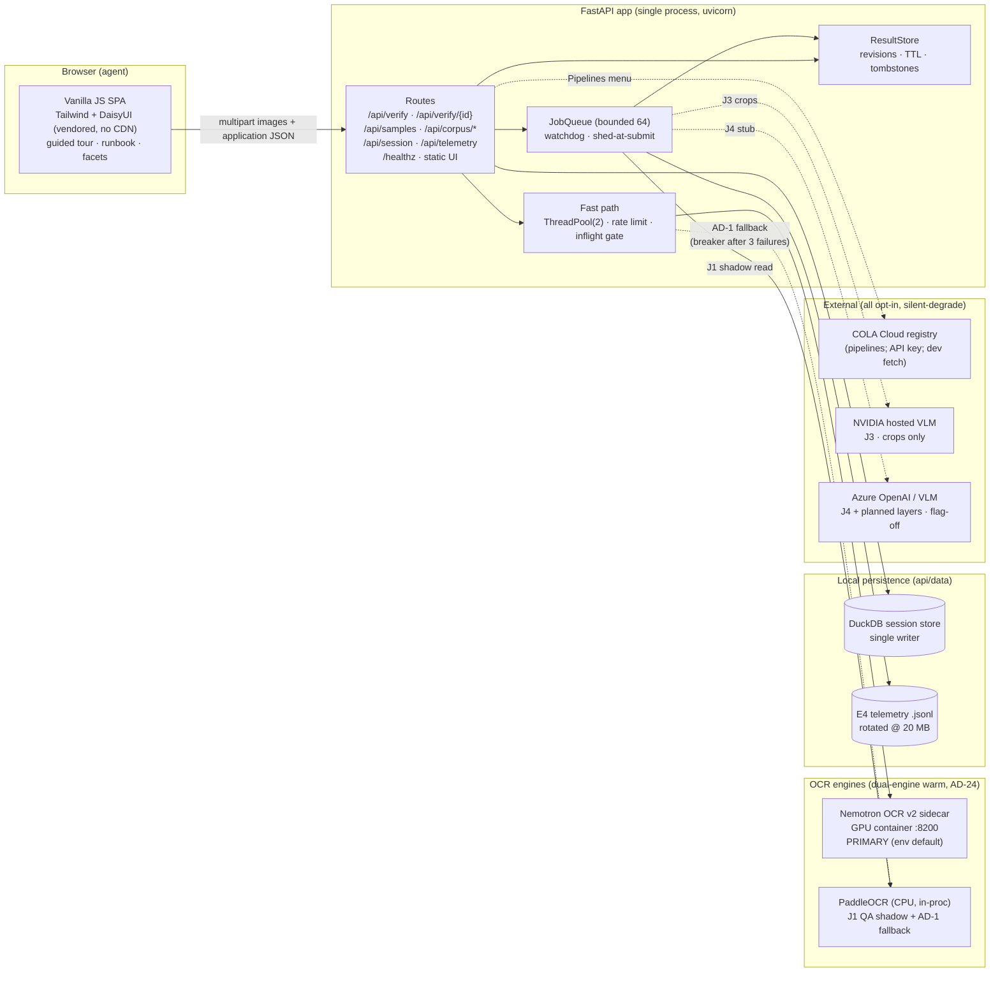
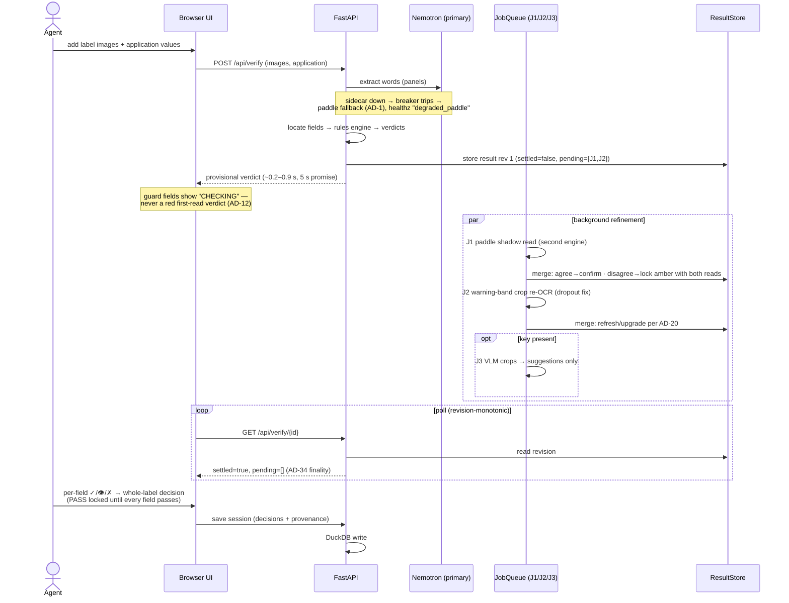
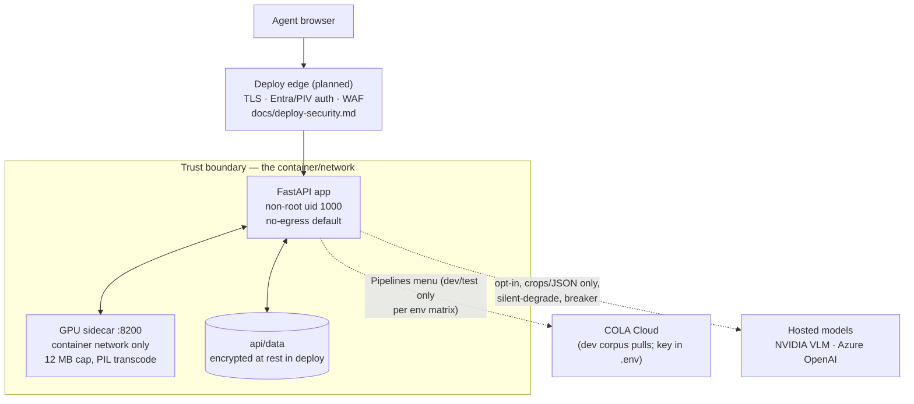

# Label Check — Systems Architecture

As built, 2026-08-03 (nemotron-default). One process, two tiers: a fast
synchronous screening path that answers inside the 5-second promise, and a
background enrichment tier that cross-checks, upgrades, and annotates
without ever reopening a settled verdict. Every external integration is
opt-in and fails silent-closed; the default runtime makes zero calls to
anything outside its own compose network (proven in CI).

**Engine default:** the primary OCR is the Nemotron OCR v2 GPU sidecar
(`LABELCHECK_EXTRACTOR=nemotron`, set in `.env` and pinned in the GPU
compose); PaddleOCR remains in-process as the J1 QA shadow and the AD-1
fallback. Rationale in “Why Nemotron as the default” below.

## System context

Solid arrows are the default deployment; dashed arrows exist only when
their flag/key is present — absent, behavior is byte-identical (decision
D3, enforced by the no-egress CI check).

## Tech stack

| Layer | Choice | Why / constraints |
|---|---|---|
| UI | Vanilla JS + Tailwind v4 + DaisyUI 5, compiled offline and vendored | no-CDN/no-egress applies to the browser too; corporate theme, 508 focus rings, axe 0 violations in CI |
| API | FastAPI + uvicorn, single process, workers=1 | AD-25: in-proc stores require one worker; TrustedHost, per-IP token bucket |
| OCR (primary) | Nemotron OCR v2 in an NGC sidecar, HTTP adapter (stdlib client) | default via `LABELCHECK_EXTRACTOR=nemotron`; single-lock inference on 4 GB VRAM; 12 MB cap + PIL transcode at its boundary |
| OCR (QA + fallback) | PaddleOCR 3.2 (CPU, in-proc), pins load-bearing | J1 shadow on every guard field; AD-1 circuit-breaker fallback (healthz `degraded_paddle`); version + hash + weight-digest triple-locked |
| Rules | Pure-Python modules: `warning` `abv` `net_contents` `wine` `malt` `contrast` `normalize` | CFR-cited, commodity-aware; statutory text is exact-match only, no model in the verdict path |
| Location | `locator` — line grouping, fuzzy field search, warning block reconstruction | vertical-word isolation + column discipline (BAM/anatomy audit fixes) |
| Jobs | stdlib ThreadPool + custom JobQueue/ResultStore | bounded, watchdogged, revision-monotonic polling |
| Persistence | DuckDB (sessions incl. images) + rotated JSONL (telemetry) | single-writer rule: docker and native must not share api/data |
| Assist models | NVIDIA-hosted Nano VL (J3, crops-only); Azure OpenAI (J4, stub) | suggestion-only — cannot change a field status (test-enforced) |
| Supply chain | pip hash lock (1,119 hashes) · CycloneDX SBOM · digest-pinned bases · non-root images | EO 14028 posture; weekly trivy; PRC-origin annotations |
| CI | GitHub Actions: tests + no-egress proof + axe; weekly image build/scan | gates on every push once the repo is pushed |

## Data flow — the two-tier check

## Integration boundaries

Rules that hold at every boundary: full label images never leave the
process (crops only, and only to the VLM path); assistive output never
mutates a status; secrets live in `.env`/Key Vault and are never logged;
absence of any key produces byte-identical behavior.

## Why Nemotron as the default

The engine swap is an env var by design (PLAN.md posture) — what makes
flipping it the RIGHT default is that every known weakness of the primary
is somebody else's job in this architecture:

- **Known failure mode, designed counter.** Nemotron's single-scale
  `infer_length=1024` drops characters on dense statutory small print —
  its provisional Government Warning read is routinely wrong. That is
  precisely what J2 (warning-band crop re-OCR) exists to correct, and
  AD-12 keeps guard fields showing “CHECKING” instead of a red first
  read. The rollup fix (screening_result recomputed on every read) closed
  the last place the provisional read could leak into a settled payload.
- **Nothing settles on one engine's word.** J1 shadows every guard field
  with paddle; agreement confirms, disagreement locks the field amber
  with both reads shown (AD-20). The green + no-read rule and shadow
  recovery handle the asymmetric-read cases. Determinism holds: same
  image → same settled verdict, 3/3, re-proven on the nemotron path.
- **Failure degrades, never blocks.** Circuit breaker (3 consecutive
  sidecar failures → 30 s cooloff) flips the fast path to the warmed
  paddle fallback; `/healthz` reports `degraded_paddle` while verdicts
  keep flowing (AD-24 dual-warm makes the fallback instant).
- **Where it wins:** measured per-engine error profiles
  (docs/research/removing-paddle-nemotron-only.md) — stronger on brand
  display faces and layout-odd text; confidence from recognizer token
  probabilities with a per-engine floor (ContextVar: paddle 0.60,
  nemotron 0.70) so “confident” means the same thing on both engines.
- **Supply-chain angle:** primary inference moves to US-lineage
  weights; the PRC-origin paddle stack remains (QA/fallback) but is
  triple-locked and no longer the deciding voice on a clean run — the
  incremental-derisking path the supply-chain research recommends.

Config surface: `.env` (`LABELCHECK_EXTRACTOR=nemotron`,
`NEMOTRON_OCR_URL=http://localhost:8200` for native runs) and the GPU
compose pins the same in-service (`http://nemotron-ocr:8000`). Unsetting
the variable reverts to paddle-primary with zero code change.

## Evaluation & evidence plane

Not runtime components, but load-bearing architecture: golden corpora
(planted traps + degradations), the per-pipeline golden COLA sets, TTB's
own reference artifacts ingested as fixtures (BAM c10 labels, three
Anatomy tools), batch-physics sets (4×300), and the E4 telemetry stream
feeding future calibration (N7). The rule the whole plane enforces:
**TTB's approvable examples must screen clean; the planted traps must
stay red; degradation must land honest ambers.**

## Deployment shapes

- **Local dev:** `docker compose` CPU profile, or native venv + uvicorn
  (never both against the same `api/data`).
- **GPU dev:** `docker-compose.gpu.yml` — Nemotron sidecar + dual-engine
  warm (paddle stays as QA/fallback).
- **Azure (planned):** build-once-promote-by-digest through dev/test/
  stage/prod per docs/plans/azure-devsecops-cicd.md — signed images in
  ACR, ACA revisions, Key Vault, Front Door/WAF, Entra → PIV.
